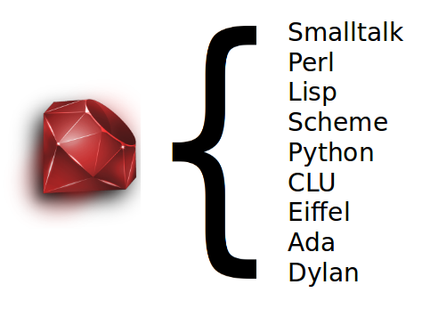

!SLIDE why_ruby center transition=scrollUp
# Why Ruby? #
    "Ruby is designed to make programmers happy"  
    Matz

!SLIDE transition=scrollUp
# Java #
    @@@ java
    public class HelloWorld {
        public static void main(String args[]) {
            System.out.println("Hello World!");
        }
    }

!SLIDE transition=scrollUp
# Ruby #
    @@@ ruby
    puts "Hello World!"

!SLIDE what_ruby bullets incremental transition=scrollUp
# What's Ruby? #
    * Interpreted Scripting Language
    * Ruby was first released on July 95 by a 
      Japanese nut (Yukihiro Matz Matsumoto)
    * An 100% OO language (well, 99.9%)
    * Dynamically typed language
    * Concise. Simple. Fun!
    * Multi-platforms and Open Source

!SLIDE center transition=scrollUp

!SLIDE installation bullets transition=scrollUp
# Get Ruby Running #
    * TryRuby

    * Windows
      Ruby One-Click Installer

    * Ubuntu/Mac OS
      Install Ruby through RVM
      (Ruby Virtual Manager)

    * Ruby Implementations
      MRI, JRuby, IronRuby, MacRuby, Rubinius

!SLIDE IDE center transition=scrollUp
# Ruby IDE? #

    RubyMine, NetBeans, RedRails  
    Textmate, VIM, Gedit + GMate, Redcar  
    any text editors  

    Currently, I'm using GVim
